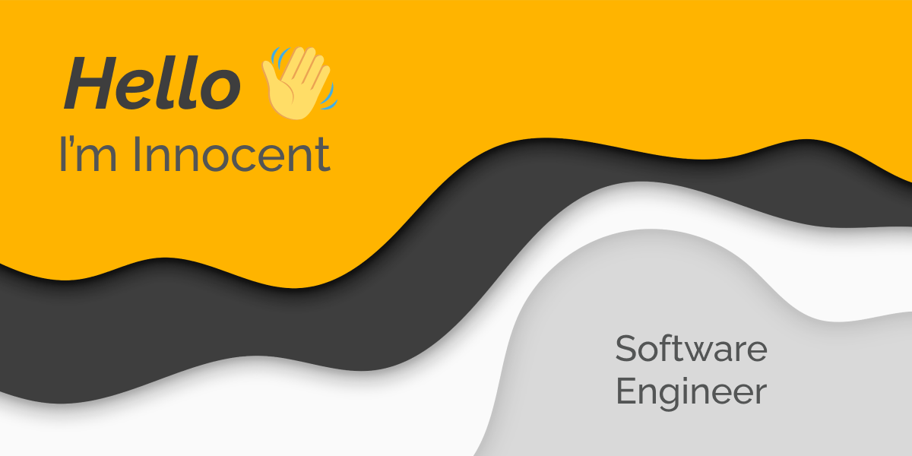

    

 

---

<h4> Connect with me </h4>

---

## About me:mage_man:

    My name is <strong>Innocent Chukwuemeka</strong> a passionate <strong>Software Engineer</strong>. I enjoy coding as much as I love anime and interacting with other tech individuals and look forward to new opportunities in exploring the different aspect of the tech space.

 

## What I'm up to currently:computer:

- 🔭 I’m currently working on getting better as a Software Engineer.
- 🌱 I’m currently learning a whole bunch of things.
- 👯 I’m looking to collaborating/working on projects that are fun and exciting.
- 📫 You can reach me via my [email](mailto:chukwuemeka140@gmail.com) or my socials above.
  

## Top Repositories

   
    
   
    
   <a href="https://github.com/Innocent9712/Learnable-2021-standardization-test">
    
       
   
       
   </a>
   

   

---

    
    

                                                                                                                             
                                                                                                                                 
---
